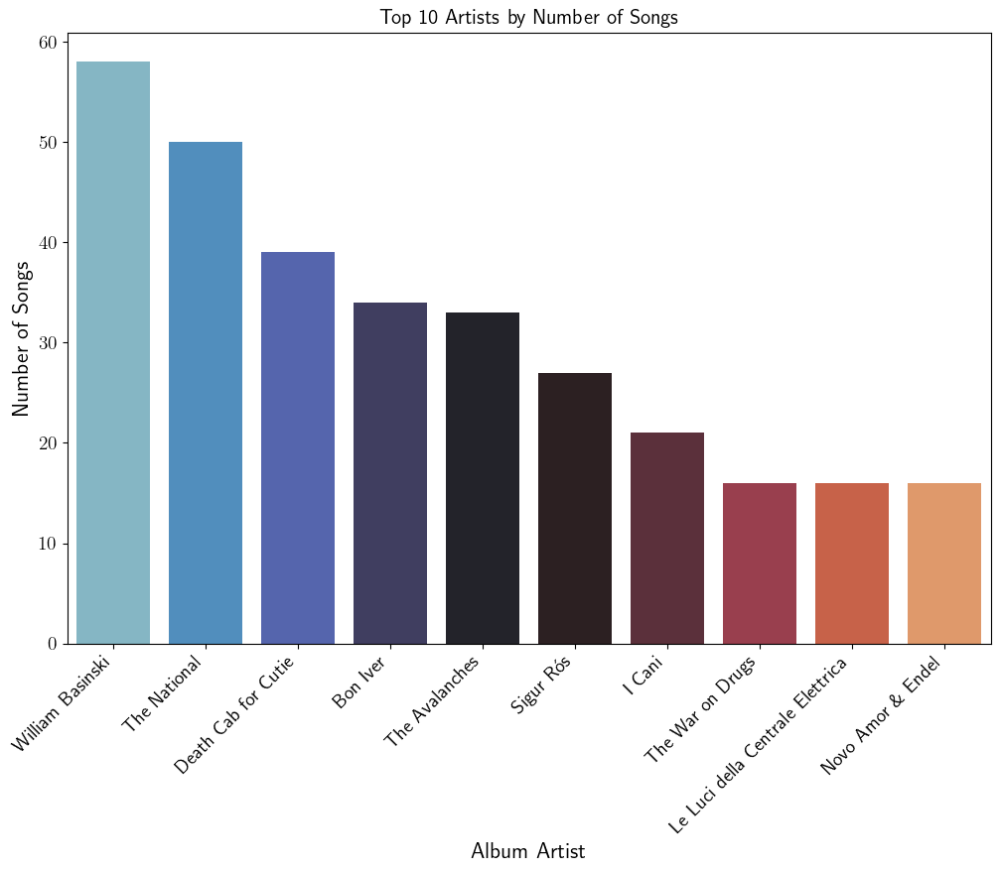

# Welcome to this readme
## This repository contains a Jupyter Notebook to help you create and visualize beautiful plots with Matplotlib and Seaborn for your Music Library.

Here I will show some of these plot. 

- Feel free to customize it for your purposes. 
- Feel free to clone this repository if you want.

The script reads a .xml file, that can be modified accordingly.
(I have to give credit to https://cv.franciscoyira.com/project/music-python-r/ for the part related to exporting the .xml file.)

You will need to install some packages for the data visualization/analysis parts.

Below there is a small excerpt from the Jupyter Notebook, with some annotations. Please refer to the .ipynb file and not to the text below for the updated and correct code.

```python
# - # - # - # - # - # - # - # - # - # - # - #
# import the necessary package
# set the text to LaTEX font and other graphical tweaks

# open the .xml file - 
```
First plot! This will show the number of pages
```python
# plot a histogram of column '# pages'
```

```python

